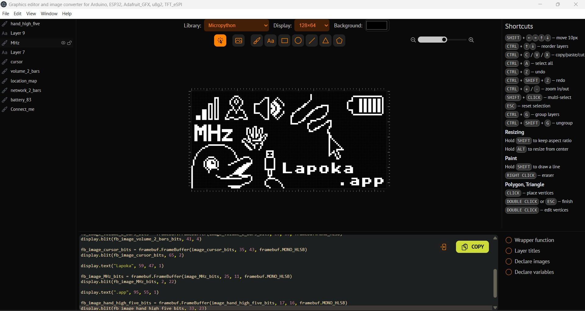

# Lopaka — Stunning Graphics Editor (App Port)

Lopaka is an open-source graphics editor designed to create pixel-perfect interfaces for embedded screens including **TFT_eSPI**, **U8g2**, **AdafruitGFX**, and **Flipper Zero**. 

This fork specifically ports the original web-based Lopaka tool into a **standalone application**, providing a more integrated experience for local firmware development.



## 🚀 Key Features

* **Pixel-Perfect Editor:** Design directly for small-scale embedded displays.
* **Instant Code Generation:** Generate C/C++ source code for Arduino, ESP32, or STM32 projects.
* **Standalone Workflow:** Run as a dedicated app with offline support and local file access.
* **Dynamic Shapes & Fonts:** Full support for popular embedded fonts and custom drawing tools.
* **Image Conversion:** Auto-generate XBMP graphics from your own images.
* **Live Preview:** Real-time previewing for Flipper Zero and other hardware targets.

## 📟 Supported Platforms

* **Frameworks:** TFT_eSPI, u8g2, AdafruitGFX, ESPHome (coming soon).
* **Hardware:** Flipper Zero, Inkplate, Watchy, M5Stack (M5GFX), LovyanGFX.

## 🛠 Installation

This port is built using **VueJS 3** and **Vite**.

### For Users
Download the latest executable for your operating system from the [Releases](https://github.com) page.

### For Developers
If you want to build the app from source, ensure you have [pnpm](https://pnpm.io) installed.

1. **Clone the fork:**
   ```bash
   git clone https://github.com
   cd lopaka
2. **Install dependencies:**
    ```bash
   bashpnpm install
3. **Run development server:**
   ```bash
   bashpnpm dev
4. **Build for production:**
   ```bash
   pnpm run build:exe
### Credits: 
This project is a fork of the original Lopaka editor. Huge thanks to the original creators and contributors:Original Creator: sbrinTop Contributors: deadlink, gaai, alploskov, bjorndFor the full list of original contributors, see the original contributors graph.💬 Feedback & SupportIf you encounter issues specific to the App Port, please submit an Issue in this repository.For general editor feedback or to join the community:Join the DiscordFollow on TwitterSupport the original creator via GitHub Sponsorship
